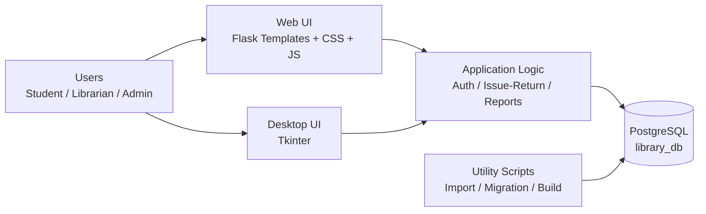
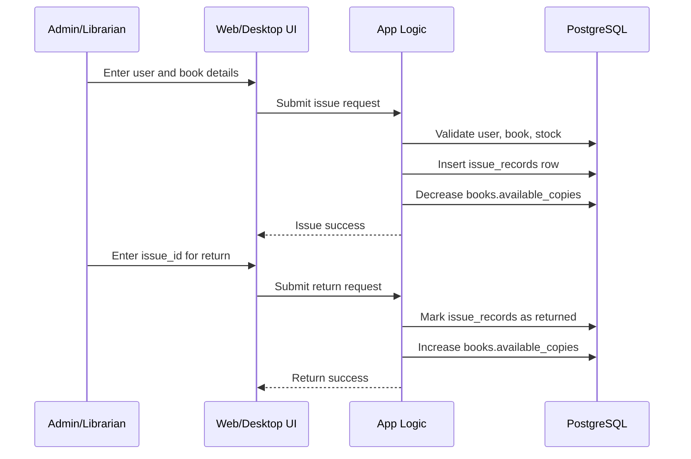
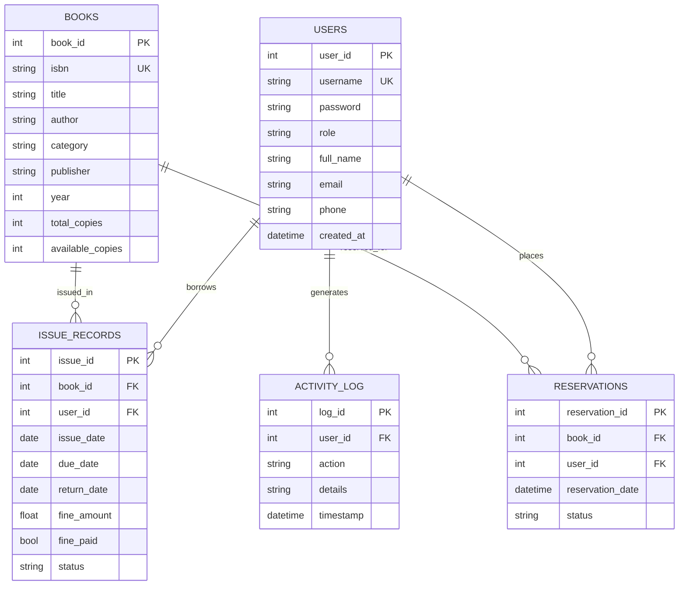

# Library Management System (Desktop + Web)

A complete role-based Library Management System built in Python with two interfaces:
- Desktop app using Tkinter
- Web app using Flask + Jinja templates

This repository also includes data import utilities, migration helpers, bulk issue scripts, and build/distribution tooling.

## Table of Contents
1. Project Overview
2. What This Project Solves
3. Architecture (with Mermaid)
4. Tech Stack
5. Feature Matrix
6. Repository Structure
7. Web Routes and Access Control
8. Database Schema and ER Diagram
9. Setup and Run Guide
10. Environment Configuration
11. Data Import and Utility Scripts
12. Build and Distribution
13. Deployment Notes
14. Security Notes
15. Troubleshooting
16. Demo Flow for Presentation
17. Roadmap

## 1. Project Overview

This project handles end-to-end library operations:
- User authentication and role-based access
- Book inventory management
- Book issue and return workflows
- Reports and activity logging
- Search across users and books

Supported roles:
- Admin
- Librarian
- Student

Current UI stack in repo:
- Desktop UI: [library_system.py](library_system.py)
- Web UI: [app.py](app.py) with templates in [templates](templates)

## 2. What This Project Solves

Traditional library workflows are often manual and error-prone. This system centralizes:
- Book stock tracking
- Due-date and return lifecycle
- User-level visibility and permissions
- Historical activity logs for audit and monitoring

## 3. Architecture (with Mermaid)

### 3.1 High-Level Component Flow



### 3.2 Issue and Return Flow (Simple Sequence)



### 3.3 Layered View
- Presentation Layer: Tkinter desktop + Flask templates
- Application Layer: auth, role checks, issue/return, reporting, search
- Data Layer: PostgreSQL tables (users, books, issue_records, reservations, activity_log)
- Operations Layer: import scripts, migration scripts, packaging scripts

## 4. Tech Stack

| Layer | Technology |
|---|---|
| Language | Python 3.x |
| Web Framework | Flask |
| Desktop UI | Tkinter |
| Database | PostgreSQL (primary runtime DB) |
| DB Driver | psycopg2-binary |
| Templates | Jinja2 |
| Frontend | HTML, CSS, Vanilla JavaScript |
| Env Config | python-dotenv |
| Data Import | pandas, openpyxl, requests |
| Build | PyInstaller |

Pinned dependencies in [requirements-web.txt](requirements-web.txt):
- Flask==2.3.2
- Flask-CORS==4.0.0
- psycopg2-binary==2.9.9
- python-dotenv==1.0.0

Pinned dependencies in [requirements.txt](requirements.txt):
- psycopg2-binary==2.9.9
- python-dotenv==1.0.0

## 5. Feature Matrix

| Feature | Student | Librarian | Admin |
|---|---:|---:|---:|
| Login/Logout | Yes | Yes | Yes |
| Dashboard access | Yes | Yes | Yes |
| Search books | Yes | Yes | Yes |
| Search users | No | Yes | Yes |
| My books view | Yes | Yes (staff view expanded) | Yes (staff view expanded) |
| Add books | No | Yes | Yes |
| Issue books | No | Yes | Yes |
| Return books | No | Yes | Yes |
| Manage users | No | Yes | Yes |
| Reports | No | Yes | Yes |
| Activity log | No | Yes | Yes |

Web dashboard UX includes:
- Sidebar menu toggle for responsive layout
- Theme toggle (dark/light) with persistence
- Search snapshots for books and users
- Greeting card with quick actions for staff

## 6. Repository Structure

```text
library-python/
├── app.py
├── library_system.py
├── templates/
│   ├── base.html
│   ├── dashboard.html
│   ├── login.html
│   ├── my_books.html
│   ├── manage_users.html
│   ├── issued_books.html
│   ├── add_book.html
│   ├── issue_book.html
│   ├── return_book.html
│   ├── reports.html
│   ├── activity_log.html
│   ├── 404.html
│   └── _avatar.html
├── static/
│   ├── styles.css
│   └── logo-wide.png
├── import_students_postgres.py
├── import_google_books.py
├── issue_subject_books.py
├── top_up_students_with_books.py
├── migrate_to_pg.py
├── fix_placeholders.py
├── build.py
├── create_distribution.py
├── setup_server.py
├── requirements-web.txt
├── requirements.txt
├── DEPLOYMENT_GUIDE.md
├── project.md
└── README.md
```

## 7. Web Routes and Access Control

Routes defined in [app.py](app.py):

| Method | Route | Access |
|---|---|---|
| GET | / | Public (redirect to login) |
| GET, POST | /login | Public |
| GET | /dashboard | Authenticated |
| GET | /api/search-books | Authenticated |
| GET | /api/search-users | Staff only |
| GET | /my-books | Authenticated |
| GET | /manage-users | Staff only |
| GET | /issued-books | Staff only |
| GET | /reports | Staff only |
| GET | /activity-log | Staff only |
| GET, POST | /add-book | Staff only |
| GET, POST | /issue-book | Staff only |
| GET, POST | /return-book | Staff only |
| GET | /logout | Authenticated |

Decorators used:
- login_required
- staff_required

## 8. Database Schema and ER Diagram

### 8.1 Main Tables
- users
- books
- issue_records
- reservations
- activity_log

### 8.2 ER Diagram



### 8.3 Important Data Note
This repo has mixed historical data paths:
- Runtime web/desktop apps use PostgreSQL.
- [add_sample_data.py](add_sample_data.py) writes into SQLite file [library.db](library.db).

So if you seed only SQLite, web login/search in PostgreSQL will not show that data.

## 9. Setup and Run Guide

### 9.1 Prerequisites
- Python 3.10+ recommended
- PostgreSQL running and reachable
- pip available

### 9.2 Clone and Enter Project

```bash
git clone <your-repo-url>
cd library-python
```

### 9.3 Create and Activate Virtual Environment (Recommended)

Windows PowerShell:

```powershell
python -m venv .venv
.\.venv\Scripts\Activate.ps1
```

### 9.4 Install Dependencies

For web mode:

```bash
pip install -r requirements-web.txt
```

For desktop mode minimum:

```bash
pip install -r requirements.txt
```

If you will run import/build scripts too:

```bash
pip install pandas openpyxl requests pyinstaller
```

### 9.5 Configure Environment

Copy [ .env.example ](.env.example) to .env and set real values:

```env
GOOGLE_BOOKS_API_KEY=your_api_key
DB_HOST=localhost
DB_PORT=5432
DB_NAME=library_db
DB_USER=postgres
DB_PASSWORD=your_password
```

### 9.6 Run Web App

```bash
python app.py
```

Open: http://localhost:5000

### 9.7 Run Desktop App

```bash
python library_system.py
```

Desktop app initializes tables and creates default admin user if missing:
- Username: admin
- Password: admin123

## 10. Environment Configuration

Environment variables used by web and script tools:
- DB_HOST
- DB_PORT
- DB_NAME
- DB_USER
- DB_PASSWORD
- GOOGLE_BOOKS_API_KEY

Reference template: [.env.example](.env.example)

## 11. Data Import and Utility Scripts

### 11.1 Import students from Excel to PostgreSQL

```bash
python import_students_postgres.py --excel "students.xlsx" --host localhost --port 5432 --db library_db --user postgres --password your_password
```

What it does:
- Detects header rows from sheets
- Normalizes common column aliases
- Upserts students into users table
- Hashes passwords with SHA-256

### 11.2 Import books from Google Books API

```bash
python import_google_books.py
```

Requirements:
- Valid GOOGLE_BOOKS_API_KEY in .env

### 11.3 Subject-wise bulk issue script

```bash
python issue_subject_books.py
```

### 11.4 Top-up students with no issued books

```bash
python top_up_students_with_books.py
```

### 11.5 SQL placeholder migration helper

```bash
python migrate_to_pg.py
python fix_placeholders.py
```

## 12. Build and Distribution

### 12.1 Build desktop executable

```bash
python build.py
```

Output typically appears in dist/ as LibrarySystem.exe.

### 12.2 Create distribution package

```bash
python create_distribution.py
```

Generates a timestamped distribution folder with:
- executable
- env template
- setup docs
- connection test script

### 12.3 Automated server setup helper

```bash
python setup_server.py
```

## 13. Deployment Notes

Detailed deployment reference is available in [DEPLOYMENT_GUIDE.md](DEPLOYMENT_GUIDE.md).

Typical deployment options:
- Standalone desktop executable
- Python runtime deployment
- Remote PostgreSQL server deployment

Recommended production checklist:
- Use strong DB password
- Keep .env out of Git
- Restrict PostgreSQL network access
- Schedule database backups

## 14. Security Notes

Implemented:
- Password hashing using SHA-256
- Session-based authentication
- Role-based page and API guards
- Activity logging of key actions

Recommended hardening:
- Move Flask secret key to environment variable
- Add CSRF protection for forms
- Add login rate limiting
- Add password reset and policy enforcement

## 15. Troubleshooting

Common fixes:
- Login fails:
  - Verify user exists in PostgreSQL users table.
  - Ensure password is stored as SHA-256 hash.
- Web app shows empty data:
  - Check you imported data into PostgreSQL, not only SQLite.
- DB connection errors:
  - Recheck DB_HOST, DB_PORT, DB_NAME, DB_USER, DB_PASSWORD in .env.
- Import errors:
  - Ensure pandas/openpyxl/requests are installed.

## 16. Demo Flow for Presentation

Use this flow for a strong project demo:
1. Login as admin/librarian
2. Show dashboard metrics and dark mode toggle
3. Search books and users
4. Add a new book
5. Issue a book
6. Return the same book
7. Open reports and activity log
8. Show import scripts and architecture diagram

## 17. Roadmap

Possible future improvements:
- Full automated test suite
- CI/CD pipeline
- Docker-based deployment
- Email notifications for due/overdue
- OAuth-based login
- Better fine and payment workflows

---

If you want a college presentation version, refer to [project.md](project.md) for an A-Z narrative format in Hinglish.
