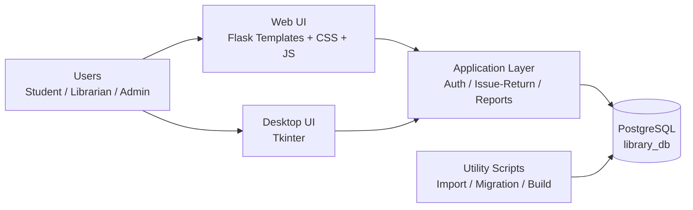

# Project Analysis - Library Management System (A to Z)

## 0. Quick Intro
Ye project ek complete Library Management System hai jisme 2 runnable variants hain:
1. Desktop app (Tkinter based) - `library_system.py`
2. Web app (Flask based) - `app.py` + HTML templates

Core business logic same domain solve karta hai: user management, book inventory, issue/return lifecycle, reports, and activity tracking.

---

## 1. High-Level Architecture

### 1.1 Logical Layers
1. Presentation Layer
   - Desktop UI: Tkinter
   - Web UI: Flask templates + CSS + JS
2. Application Layer
   - Auth, role checks, issue/return flow, search logic
3. Data Layer
   - PostgreSQL (`library_db`), tables: users, books, issue_records, reservations, activity_log
4. Utility/Automation Layer
   - Import scripts, migration scripts, build/distribution scripts

### 1.2 Runtime Flow (Web)
Browser -> Flask routes (`app.py`) -> PostgreSQL -> Templates render -> Client-side filtering/search JS

### 1.3 Runtime Flow (Desktop)
Tkinter UI events -> `LibraryDatabase` methods (`library_system.py`) -> PostgreSQL -> UI tables/forms update

### 1.4 Architecture Diagram (Simple Visual Flow)

Simple visual explanation:
- User web ya desktop UI se interact karta hai.
- Dono UI application layer ko hit karte hain jahan business logic run hota hai.
- Application layer PostgreSQL me read/write operations karta hai.
- Utility scripts (imports/migrations) direct DB ko prepare/update karte hain.

---

## 2. Tech Stack

## A. Application Layer
- Python 3.11.9
- Flask (web backend)
- Tkinter (desktop UI)

## B. Backend & API
- Flask routing and session management
- Role guards using decorators: login_required, staff_required
- JSON API endpoints for search (`/api/search-books`, `/api/search-users`)

## C. Client/UI
- Jinja2 templates (Flask default)
- HTML + CSS + vanilla JavaScript
- Responsive dashboard, sidebar toggle, table search

## D. Database
- PostgreSQL via `psycopg2`
- Legacy/local SQLite artifacts still exist for some scripts

## E. Environment/Config
- `.env` via `python-dotenv`
- DB_HOST, DB_PORT, DB_NAME, DB_USER, DB_PASSWORD
- GOOGLE_BOOKS_API_KEY (for import script only)

## F. Security
- SHA-256 password hashing (`hashlib.sha256`)
- Role-based access control (admin/librarian/student)
- Session based login state

## G. Data/ETL
- Excel import (`pandas`, `openpyxl`) for student onboarding
- Google Books API import (`requests`) for book catalog seeding

## H. Packaging/Ops
- PyInstaller based executable build
- Distribution folder generators + setup docs

---

## 3. Dependency Matrix

### 3.1 Pinned Runtime (Web)
From `requirements-web.txt`:
- Flask==2.3.2
- Flask-CORS==4.0.0
- psycopg2-binary==2.9.9
- python-dotenv==1.0.0

### 3.2 Base Runtime
From `requirements.txt`:
- psycopg2-binary==2.9.9
- python-dotenv==1.0.0

### 3.3 Additional Libraries Used by Scripts (not fully pinned in requirements files)
- requests
- pandas
- openpyxl
- pyinstaller (build-time tool)

Recommendation for full project tooling setup:
- `pip install -r requirements-web.txt requests pandas openpyxl pyinstaller`

---

## 4. Core Modules and Responsibilities

### 4.1 `app.py` (Web Version)
Main responsibilities:
- Login/logout and session set/clear
- Dashboard stats aggregation
- Role-protected pages (manage users, reports, issued books, etc.)
- Issue and return transaction handling
- Search APIs for books/users
- Avatar metadata decoration for UI personalization

Routes available:
- `/`
- `/login`
- `/dashboard`
- `/api/search-books`
- `/api/search-users`
- `/my-books`
- `/manage-users`
- `/issued-books`
- `/reports`
- `/activity-log`
- `/add-book`
- `/issue-book`
- `/return-book`
- `/logout`

### 4.2 `library_system.py` (Desktop Version)
Main responsibilities:
- Modern Tkinter UI with themed widgets
- DB initialization and table creation
- Admin account bootstrap
- Registration/login flows
- Search/issue/return/fine calculations
- Reports and activity logging
- Reservation features (desktop-side capabilities)

### 4.3 Data/Utility Scripts
- `import_students_postgres.py`: Excel to PostgreSQL users upsert
- `import_google_books.py`: Google Books API se bulk catalog import
- `add_sample_data.py`: SQLite sample data generation (important mismatch noted below)
- `issue_subject_books.py`: Subject-wise bulk issue automation
- `top_up_students_with_books.py`: Students with zero issues ko top-up issue
- `migrate_to_pg.py` and `fix_placeholders.py`: SQL placeholder migration utilities
- `build.py`: pyinstaller build
- `create_distribution.py`: deployment package generation
- `setup_server.py`: server-side PostgreSQL/firewall setup helper

---

## 5. Database Schema (Current Model)

### 5.1 users
- user_id (PK)
- username (unique)
- password (SHA-256 hash)
- role (admin/librarian/student)
- full_name
- email
- phone
- created_at

### 5.2 books
- book_id (PK)
- isbn (unique)
- title, author, category, publisher, year
- total_copies, available_copies
- shelf_location, description
- added_at

### 5.3 issue_records
- issue_id (PK)
- book_id (FK)
- user_id (FK)
- issue_date, due_date, return_date
- fine_amount, fine_paid
- status (issued/returned)

### 5.4 reservations
- reservation_id (PK)
- book_id (FK)
- user_id (FK)
- reservation_date
- status

### 5.5 activity_log
- log_id (PK)
- user_id (FK)
- action
- details
- timestamp

---

## 6. Authentication and Authorization

### 6.1 Login Mechanics
- Username + password from form
- Password hash generated by SHA-256
- `users` table match check
- Successful login on session values set:
  - user_id
  - username
  - role
  - full_name

### 6.2 Role Enforcement
- `login_required`: any authenticated user
- `staff_required`: only admin/librarian

### 6.3 Observed Security Positives
- Plaintext passwords store nahi hote
- RBAC decorators implemented
- Activity logs maintained

### 6.4 Hardening Suggestions
- `app.secret_key` env variable me move karo (hardcoded avoid)
- Password policy + reset flow add karo
- Rate limiting for login endpoint
- CSRF protection for forms

---

## 7. Feature Coverage (Desktop vs Web)

### 7.1 Implemented in Web
- Login/logout
- Dashboard stats
- Book search and user search
- My books
- Manage users
- Issued books
- Reports
- Activity log
- Add book
- Issue/return operations
- UI enhancements (sidebar toggle, dynamic greeting, table search)

### 7.2 Desktop-Heavy Features
- Student self-registration screen
- Reservation workflows
- Extended fine/overdue visual workflows
- Richer Tkinter analytics UX

Presentation tip:
- Clearly bolo ki project dual-interface architecture follow karta hai: desktop and web.

---

## 8. UI Layer Breakdown (Web)

Templates in `templates/`:
- `base.html`: common layout/navbar
- `login.html`: login screen
- `dashboard.html`: stats + quick actions + snapshots
- `my_books.html`: current/staff view records
- `manage_users.html`: user listing
- `issued_books.html`: active issue listing
- `issue_book.html`, `return_book.html`, `add_book.html`
- `reports.html`, `activity_log.html`, `404.html`
- `_avatar.html`: reusable avatar macro

Static assets:
- `static/styles.css`: all major styling/responsive rules
- `static/snu-techno-logo.svg`: greeting card right-side logo strip

---

## 9. Data Lifecycle in the Project

### 9.1 Master Data Sources
1. Manual book entry via UI
2. Google API import script
3. Excel student import script
4. Direct SQL/automation scripts

### 9.2 Transaction Data
- Issuance creates `issue_records`
- Return updates `issue_records` + increments `books.available_copies`
- Activity events stored in `activity_log`

### 9.3 Reporting Data
- Aggregated from `users`, `books`, `issue_records`
- Fine total from `issue_records.fine_amount`

---

## 10. Important Practical Note (Very Important for Presentation)

Current repository me mixed data pipelines hain:
- Web/Desktop app PostgreSQL use karte hain
- `add_sample_data.py` SQLite (`library.db`) use karta hai

Impact:
- Agar sample data SQLite me dala, to web login me users nahi dikhenge.
- Production/demo ke liye PostgreSQL-aligned import scripts use karo.

Recommended demo data path:
1. PostgreSQL ready karo
2. `import_students_postgres.py` run karo
3. `import_google_books.py` run karo
4. optional bulk issue scripts run karo

---

## 11. Deployment and Distribution

### 11.1 Build
- `build.py` pyinstaller use karke executable banata hai

### 11.2 Packaging
- `create_distribution.py` ready-to-share package banata hai
  - app executable
  - `.env` template
  - setup docs
  - test script

### 11.3 Server Setup
- `setup_server.py` PostgreSQL network setup and firewall helper

### 11.4 Deployment Modes
1. Standalone exe
2. Python virtual env run
3. Remote PostgreSQL server connection

---

## 12. End-to-End Business Flow

1. User login
2. Role based landing on dashboard
3. Search and browse books/users
4. Issue book (stock decrement)
5. Return book (stock increment, fine update where applicable)
6. Reports and logs

---

## 13. Current Strengths

- Dual UI options (desktop + web)
- Clear domain model for library transactions
- Role-based access controls
- Good automation scripts for bulk operations
- Search/reporting capability
- Deployment packaging scripts available

---

## 14. Current Gaps / Risks

- Dependency files incomplete for all helper scripts
- SQLite vs PostgreSQL path mismatch can confuse demos
- Google authentication not yet implemented (only Google Books import exists)
- Secret key and DB password hardcoded defaults in places

---

## 15. Suggested Production Improvements

1. Single-source DB strategy (PostgreSQL only)
2. Unified requirements file by profile:
   - web
   - desktop
   - data-tools
3. JWT/OAuth option for auth expansion
4. Audit/event schema strengthening
5. Test suite addition (unit + integration)
6. Dockerfile + CI pipeline
7. Backup and restore scripts with scheduling

---

## 16. Presentation-Ready Slide Flow (College)

1. Problem Statement
   - Library operations manual/fragmented
2. Solution Overview
   - Unified LMS with desktop + web + automation
3. Architecture Diagram
   - UI -> App -> DB -> Scripts
4. Tech Stack
   - Python ecosystem + PostgreSQL + Flask/Tkinter
5. Database Design
   - 5 key tables and relationships
6. Key Features Demo
   - Login, issue/return, reports, logs
7. Automation Value
   - Excel import, Google import, bulk issue
8. Security and RBAC
   - hashing and guarded routes
9. Deployment Strategy
   - exe + env + remote DB
10. Future Scope
   - Google OAuth, tests, CI/CD, cloud-scale

---

## 17. Viva / QnA Cheat Sheet

Q1. Is project me kaun sa DB use hota hai?
- Primary: PostgreSQL (`library_db`), but legacy SQLite artifacts still present.

Q2. Password secure kaise hai?
- SHA-256 hash store hota hai, plaintext nahi.

Q3. RBAC kaise enforce hota hai?
- Decorators: `login_required` and `staff_required`.

Q4. Scalability approach?
- DB-backed model, API-based web search, bulk utility scripts, deployment-ready packaging.

Q5. Google integration kya hai?
- Abhi Google Books API import hai; Google login OAuth abhi pending.

---

## 18. Command Cheat Sheet

### Web app run
`python app.py`

### Desktop app run
`python library_system.py`

### Import students (PostgreSQL)
`python import_students_postgres.py --excel students.xlsx --host localhost --port 5432 --db library_db --user postgres --password your_password`

### Import books from Google
`python import_google_books.py`

### Build executable
`python build.py`

---

## 19. One-Line Project Pitch for Jury

This project is a role-based, database-driven Library Management System with dual interface support (desktop and web), automated data ingestion pipelines, operational reporting, and deployment-ready tooling.

---

## 20. Final Presentation Tip

Demo ke time sabse pehle ye clear karna:
- Ye sirf UI project nahi hai; ye full workflow system hai
- Authentication + transaction + reporting + automation + deployment sab covered hai
- Real-world operations (issue, return, stock, logs, roles) end-to-end solve karta hai
